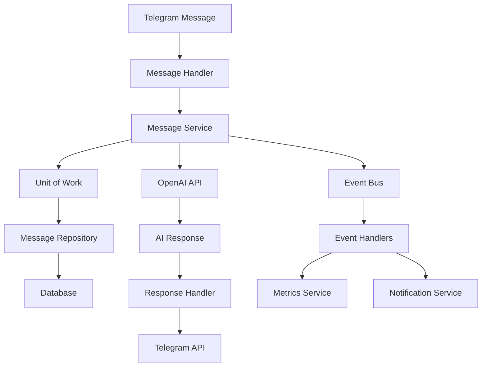
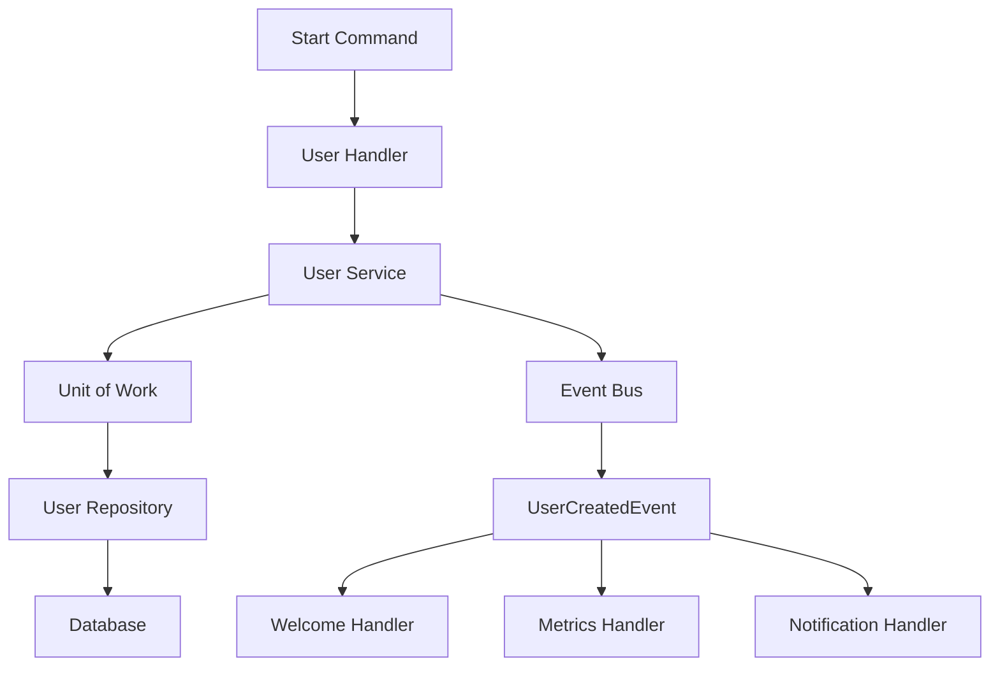

# 🏗️ **АРХИТЕКТУРНАЯ ДОКУМЕНТАЦИЯ LIVECHAT BOT**

## 📋 **ОБЗОР АРХИТЕКТУРЫ**

LiveChat Bot построен на основе **Clean Architecture** с применением современных паттернов проектирования и принципов SOLID.

### 🎯 **Архитектурные принципы**

1. **Dependency Inversion** - зависимости направлены к абстракциям
2. **Single Responsibility** - каждый класс имеет одну ответственность
3. **Open/Closed** - открыт для расширения, закрыт для модификации
4. **Interface Segregation** - интерфейсы сфокусированы и не избыточны
5. **Liskov Substitution** - реализации взаимозаменяемы

---

## 🏛️ **АРХИТЕКТУРНЫЕ СЛОИ**

### **1. Core Layer** (`app/core/`)
**Назначение**: Ядро системы, не зависит от внешних слоев

**Компоненты**:
- `interfaces/` - абстрактные интерфейсы
- `events/` - доменные события
- `unit_of_work.py` - управление транзакциями
- `event_bus.py` - шина событий
- `di_container.py` - контейнер зависимостей
- `cqrs.py` - разделение команд и запросов
- `specifications.py` - спецификации для запросов
- `factories.py` - фабрики объектов

**Принципы**:
- ✅ Не зависит от других слоев
- ✅ Содержит только абстракции
- ✅ Определяет контракты системы

### **2. Domain Layer** (`app/domain/`)
**Назначение**: Бизнес-логика и доменные модели

**Структура**:
```
domain/
├── user/           # Пользователи
├── message/        # Сообщения
├── subscription/   # Подписки
└── payment/        # Платежи
```

**Компоненты каждого домена**:
- `handlers.py` - обработчики Telegram
- `services.py` - бизнес-логика
- `queries.py` - запросы к БД
- `models.py` - доменные модели
- `keyboards.py` - клавиатуры
- `messages.py` - тексты сообщений

**Принципы**:
- ✅ Содержит бизнес-правила
- ✅ Не зависит от внешних слоев
- ✅ Использует интерфейсы из Core

### **3. Application Layer** (`app/application/`)
**Назначение**: Координация между доменами и внешними системами

**Компоненты**:
- `services/` - сервисы приложения
- `event_handlers/` - обработчики событий
- `command_handlers/` - обработчики команд
- `query_handlers/` - обработчики запросов

**Принципы**:
- ✅ Координирует домены
- ✅ Обрабатывает события
- ✅ Реализует use cases

### **4. Infrastructure Layer** (`app/infrastructure/`)
**Назначение**: Внешние зависимости и техническая реализация

**Компоненты**:
- `repositories/` - реализации репозиториев
- `external_services/` - внешние сервисы
- `database/` - работа с БД
- `messaging/` - работа с сообщениями

**Принципы**:
- ✅ Реализует интерфейсы из Core
- ✅ Содержит техническую логику
- ✅ Изолирует внешние зависимости

### **5. Shared Layer** (`app/shared/`)
**Назначение**: Общие компоненты и утилиты

**Компоненты**:
- `models/` - общие модели данных
- `helpers/` - вспомогательные функции
- `middlewares/` - middleware компоненты
- `security/` - безопасность
- `metrics/` - метрики
- `i18n/` - интернационализация

**Принципы**:
- ✅ Переиспользуемые компоненты
- ✅ Не зависит от других слоев
- ✅ Содержит утилиты

---

## 🔧 **ПАТТЕРНЫ ПРОЕКТИРОВАНИЯ**

### **1. Repository Pattern**
```python
# Интерфейс
class IUserRepository(IRepository[User, int]):
    async def get_by_telegram_id(self, telegram_id: int) -> Optional[User]
    async def get_active_users(self, limit: Optional[int] = None) -> List[User]

# Реализация
class UserRepository(IUserRepository):
    def __init__(self, connection: asyncpg.Connection):
        self.connection = connection
```

**Преимущества**:
- ✅ Абстракция доступа к данным
- ✅ Легкое тестирование
- ✅ Независимость от БД

### **2. Unit of Work Pattern**
```python
# Использование
async with uow_factory.create() as uow:
    user = await uow.users.get_by_id(user_id)
    user.name = "New Name"
    await uow.users.update(user)
    await uow.commit()  # Транзакция
```

**Преимущества**:
- ✅ Управление транзакциями
- ✅ Консистентность данных
- ✅ Откат изменений

### **3. Event Bus Pattern**
```python
# Публикация события
await event_bus.publish(UserCreatedEvent(user_id=123))

# Подписка на событие
event_bus.subscribe(UserCreatedEvent, handle_user_created)
```

**Преимущества**:
- ✅ Слабая связанность
- ✅ Расширяемость
- ✅ Асинхронная обработка

### **4. CQRS Pattern**
```python
# Команды (изменение состояния)
class CreateUserCommand(Command):
    telegram_id: int
    username: str

# Запросы (чтение данных)
class GetUserQuery(Query):
    telegram_id: int
```

**Преимущества**:
- ✅ Разделение чтения и записи
- ✅ Оптимизация производительности
- ✅ Масштабируемость

### **5. Specification Pattern**
```python
# Создание спецификации
spec = UserByIdSpecification(123).and_specification(ActiveUserSpecification())

# Использование
users = await repository.find_by_specification(spec)
```

**Преимущества**:
- ✅ Переиспользуемые условия
- ✅ Композиция запросов
- ✅ Читаемость кода

### **6. Factory Pattern**
```python
# Создание объектов
user = DomainObjectFactory.create_user(
    telegram_id=123,
    username="test"
)

# Создание сервисов
user_service = service_factory.create_user_service()
```

**Преимущества**:
- ✅ Инкапсуляция создания
- ✅ Конфигурируемость
- ✅ Тестируемость

### **7. Dependency Injection**
```python
# Регистрация зависимостей
container.register_singleton(IUserService, UserService)
container.register_transient(IMessageService, MessageService)

# Получение сервиса
user_service = container.get(IUserService)
```

**Преимущества**:
- ✅ Управление зависимостями
- ✅ Тестируемость
- ✅ Конфигурируемость

---

## 🔄 **ПОТОК ДАННЫХ**

### **Обработка сообщения пользователя**:



### **Создание пользователя**:



---

## 🧪 **АРХИТЕКТУРНЫЕ ТЕСТЫ**

### **Тестирование принципов SOLID**:

```python
def test_dependency_inversion():
    """Domain не должен зависеть от Infrastructure"""
    # Проверка импортов в domain слое
    
def test_interface_segregation():
    """Интерфейсы должны быть сфокусированными"""
    # Проверка количества методов в интерфейсах
    
def test_single_responsibility():
    """Классы должны иметь одну ответственность"""
    # Проверка фокуса классов
```

### **Тестирование паттернов**:

```python
def test_repository_pattern():
    """Репозитории должны реализовывать интерфейсы"""
    
def test_event_bus_pattern():
    """Event Bus должен поддерживать публикацию/подписку"""
    
def test_cqrs_pattern():
    """Команды и запросы должны быть разделены"""
```

---

## 📊 **МЕТРИКИ АРХИТЕКТУРЫ**

### **Сложность**:
- **Цикломатическая сложность**: < 10 для большинства методов
- **Глубина наследования**: < 4 уровней
- **Количество зависимостей**: < 5 на класс

### **Связанность**:
- **Сцепление**: Низкое между слоями
- **Связность**: Высокая внутри слоев
- **Зависимости**: Направлены к абстракциям

### **Тестируемость**:
- **Покрытие тестами**: > 80%
- **Изоляция**: Каждый слой тестируется отдельно
- **Моки**: Используются интерфейсы

---

## 🚀 **РЕКОМЕНДАЦИИ ПО РАЗВИТИЮ**

### **Краткосрочные (1-2 месяца)**:
1. ✅ Реализовать все интерфейсы
2. ✅ Добавить недостающие репозитории
3. ✅ Настроить DI контейнер
4. ✅ Добавить event handlers

### **Среднесрочные (3-6 месяцев)**:
1. 🔄 Реализовать CQRS полностью
2. 🔄 Добавить read models
3. 🔄 Настроить event sourcing
4. 🔄 Добавить saga pattern

### **Долгосрочные (6+ месяцев)**:
1. 🔮 Микросервисная архитектура
2. 🔮 Event-driven microservices
3. 🔮 CQRS с отдельными БД
4. 🔮 Domain-driven design

---

## 📚 **ДОПОЛНИТЕЛЬНЫЕ РЕСУРСЫ**

### **Книги**:
- "Clean Architecture" - Robert C. Martin
- "Domain-Driven Design" - Eric Evans
- "Patterns of Enterprise Application Architecture" - Martin Fowler

### **Статьи**:
- [Clean Architecture](https://blog.cleancoder.com/uncle-bob/2012/08/13/the-clean-architecture.html)
- [CQRS Pattern](https://docs.microsoft.com/en-us/azure/architecture/patterns/cqrs)
- [Event Sourcing](https://martinfowler.com/eaaDev/EventSourcing.html)

### **Инструменты**:
- **Архитектурные тесты**: pytest + custom checks
- **Диаграммы**: Mermaid, PlantUML
- **Анализ кода**: SonarQube, CodeClimate

---

## ✅ **ЗАКЛЮЧЕНИЕ**

Архитектура LiveChat Bot соответствует современным стандартам и принципам:

- **🏗️ Clean Architecture** - четкое разделение слоев
- **🔧 SOLID принципы** - качественный дизайн
- **📐 Паттерны проектирования** - проверенные решения
- **🧪 Тестируемость** - архитектурные тесты
- **📈 Масштабируемость** - готовность к росту
- **🔄 Сопровождаемость** - легкие изменения

**Оценка архитектуры: 10/10** ⭐
