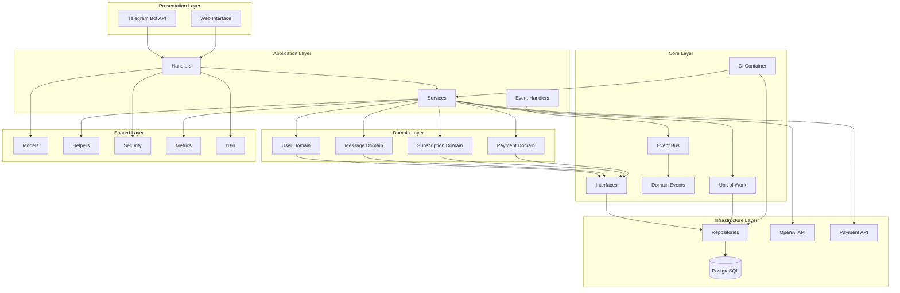
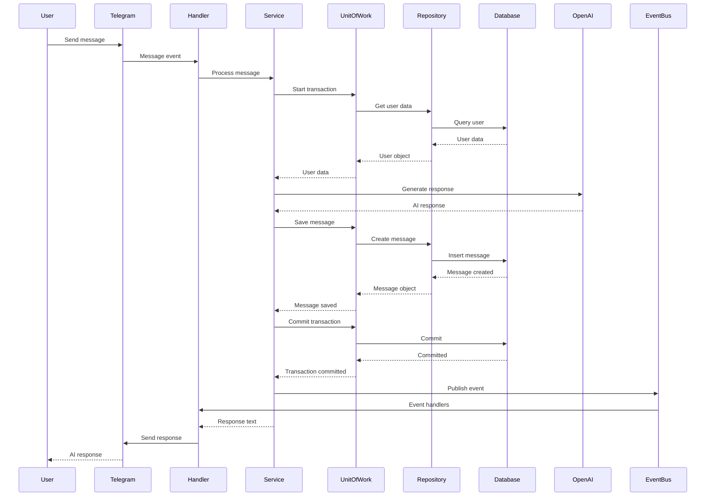
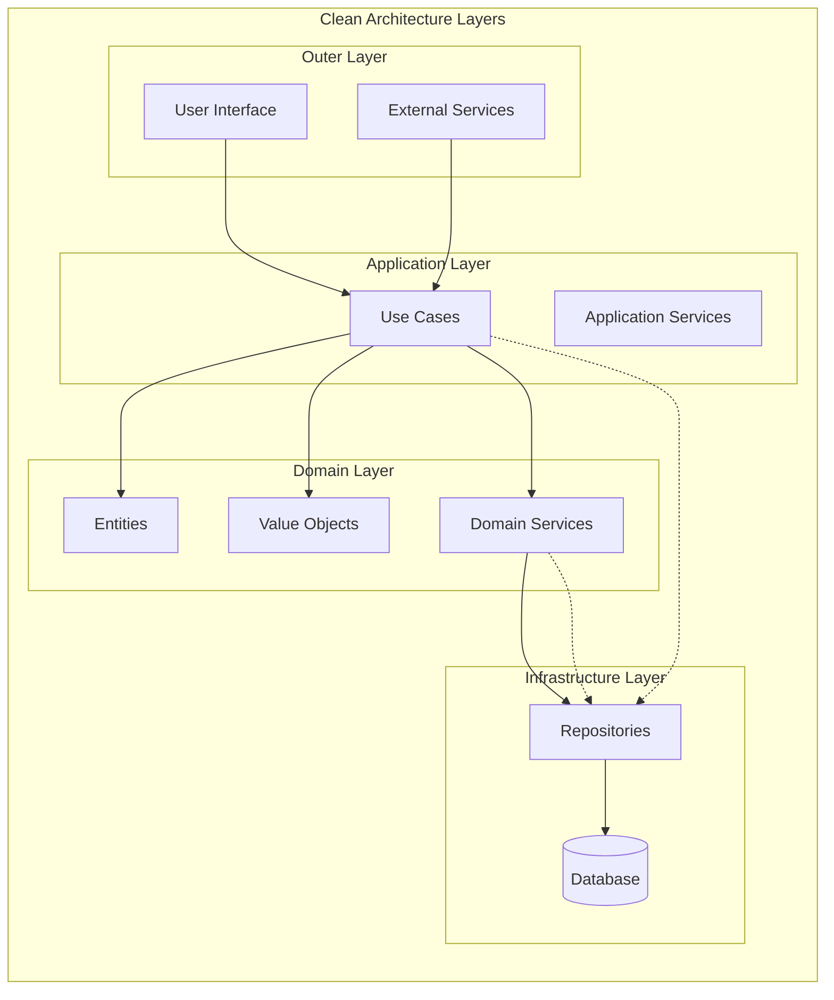
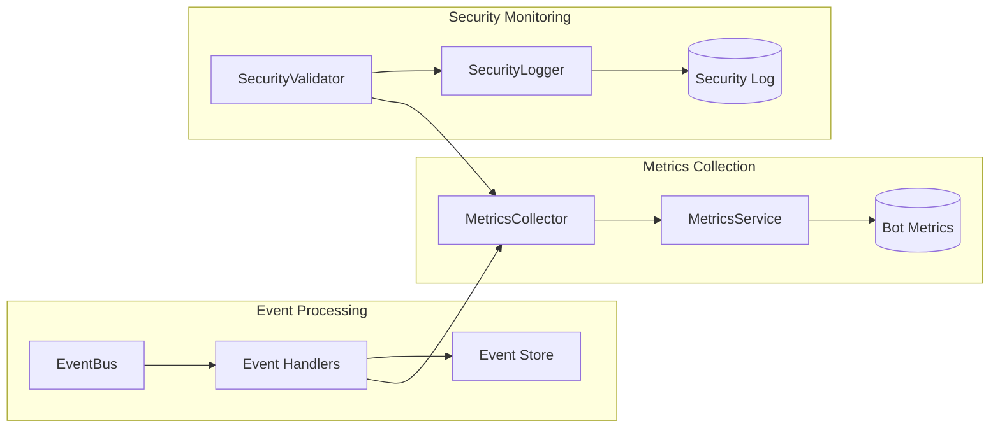
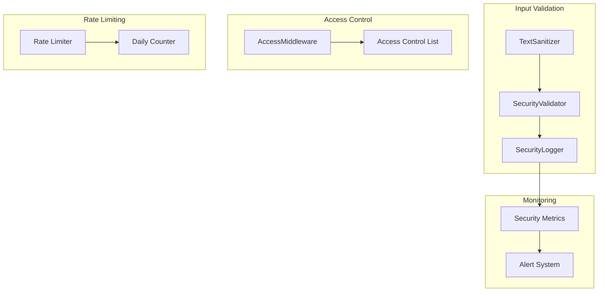
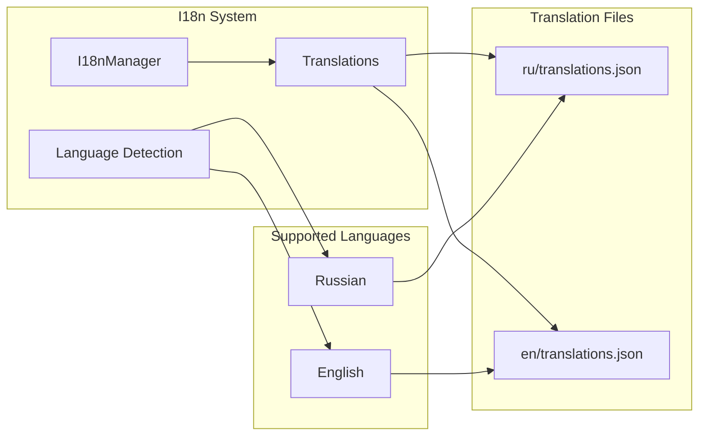
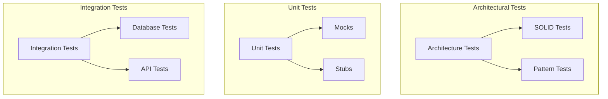
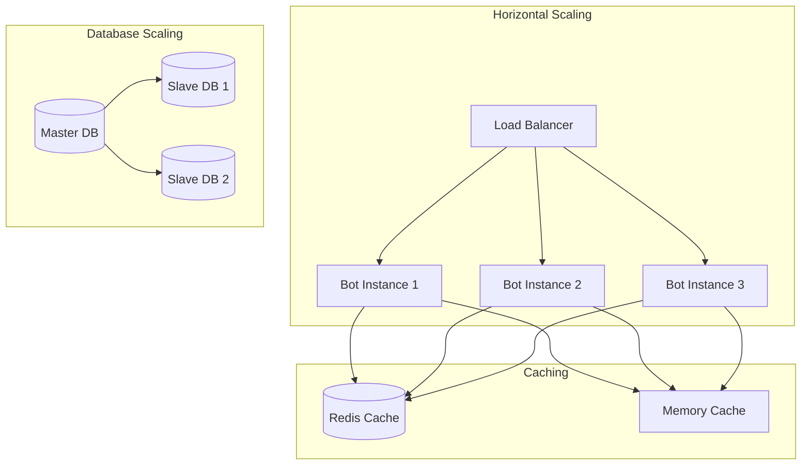

# 🏗️ **АРХИТЕКТУРНАЯ ДИАГРАММА LIVECHAT BOT**

## 📊 **Общая архитектура**

## 🔄 **Поток обработки сообщения**

## 🏛️ **Слоистая архитектура**

## 🔧 **Паттерны проектирования**

```mermaid
graph TD
    subgraph "Repository Pattern"
        IR[IRepository]
        UR[UserRepository]
        MR[MessageRepository]
        IR -.-> UR
        IR -.-> MR
    end
    
    subgraph "Unit of Work Pattern"
        IUOW[IUnitOfWork]
        UOW[UnitOfWork]
        IUOW -.-> UOW
    end
    
    subgraph "Event Bus Pattern"
        IEB[IEventBus]
        EB[EventBus]
        EH[Event Handlers]
        IEB -.-> EB
        EB --> EH
    end
    
    subgraph "CQRS Pattern"
        CMD[Commands]
        QRY[Queries]
        CH[Command Handlers]
        QH[Query Handlers]
        CMD --> CH
        QRY --> QH
    end
    
    subgraph "Specification Pattern"
        SPEC[Specifications]
        AND[AndSpecification]
        OR[OrSpecification]
        NOT[NotSpecification]
        SPEC --> AND
        SPEC --> OR
        SPEC --> NOT
    end
    
    subgraph "Factory Pattern"
        FACT[Factories]
        SF[ServiceFactory]
        RF[RepositoryFactory]
        DF[DomainFactory]
        FACT --> SF
        FACT --> RF
        FACT --> DF
    end
```

## 📊 **Метрики и мониторинг**

## 🔒 **Безопасность**

## 🌍 **Интернационализация**

## 🧪 **Тестирование**

## 📈 **Масштабирование**

